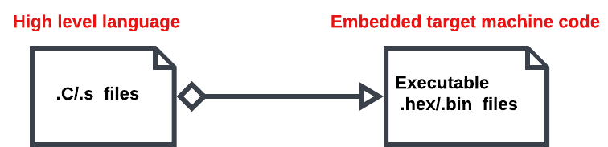

# Bare metal embedded: STM32 Programming without IDE using a Makefile and ARM Toolchain.


## Overview

This is one of my personal projects, and the main purpose of me working on this project is that I wanted to have a clear idea about what is going on under the hood by building and running bare metal executables for an ARM target using Arm GNU Toolchain. 
Sense the only arm target I have is stm32f1 blue pill, I thought that it would be a good idea if I use it for this purpose.


## What will you learn from this Repository
This Repository is intended to expose you to the first concepts of Bare Metal on STM32. More specifically, it will provide you with all the explanations necessary for a first approach to this way of programming and then lead to a real test on the STM32F103C8T6 BluePill. The title of the repository is explained by the fact that we will start from completely empty files. It will be the magic to see a Bare Metal program born from nothing.

#### Bare metal 
Bare Metal is basically a special way of programming micro-controllers. Here, no OS, no IDE, no automatically generated program but simply a bootloader and an executable.

### Roadmap and Repository deliverables

The implementation process is quite simple. From source files, the compiler then the linker will create an executable which will be downloaded to the board for execution. Here is a Summary:


*Here are the deliverables of this Repository*
* Toolchain installation.
* Understand the compilation steps of a **C Program**.
* Writing Stm32 BluePills **C** Startup file.
* Understanding different sections of **the Object file (.o file)**.
* Writing **Linker Script file** from scratch and understanding section placement.
* Linking multiple object files using a **Linker Script** and generating the **executable file(.hex)**.
* Loading the final executable on the target using **OpenOCD** and **GDB client**.

Our goal is to convert the high-level language file into an executable.



*To do that we need to use something called* **Cross Compilation**

## Cross Compilation 
**Cross Cross Compilation** is a process in which the **Cross-toolchain** runs on the host machine(here a PC under Linux or Windows) and creates executable files that runs on a different machine(ARM in our case). The PC serves as a tool to edit, compile and upload the executable to the STM32 board.

*Before going any further, you need to install these tools. Here is the procedure for Linux and Windows*

##### Installing GNU tools GCC on Debian/Linux:

* Run the command:
```bash 
sudo  apt install gcc-arm-none-eabi
```
* Check that the binaries are in the PATH and run from anywhere.

##### Installation of GNU tools GCC on Windows:

* Google: search for **gcc for arm** .
* First link([Link]https://developer.arm.com/).
* Search for **GNU arm toolchain** in the search bare.
* Choose the **GNU Arm Embedded Toolchain Downloads** link.
* Then download  ***gcc-arm-none-eabi-10-2020-q4-major-win32.exe*** .
* Install the program.
* Check the presence of binaries in ***C:\Program files(86)\GNU Tools ARM Embedded\bin***.
* In Command Prompt, try running: ***arm-none-eabi-gcc***.

### Binary functions

When you install **gcc ARM**, you find a lot of different binaries. Among these, here is a description of the most common, those that will be useful to us later:

1. ***arm-none-eabi-gcc ***: allows compiling, linking and assembling code.
2. ***arm-none-eabi-as*** : Allows assembly only.
3. ***arm-none-eabi-ld*** : allows linking only.
4. ***arm-none-eabi-objdump*** : allows to explore the files after compilation.
5. ***arm-none-eabi-readelf*** : allows to read .elf files.
6. ***arm-none-eabi-nm***: allows to list the symbols of an object file.
7. ***arm-none-eabi-objconv***: converts files.

### Compilation steps

These steps are the ones we are going to need to do during our development. They are simple but describing them here in detail gives a good overview of the compilation and its different phases. There are four steps: pre-processing, code generation, assembly and linking. This last step will be detailed later in a paragraph intended for it.

### Pre-processing
This is a step where all pre-processing directives are resolved. We obtain a file extension **.i** .


This is not compilation it's just the first stage of the compilation where all **#includes** and **C macros** will be resolved and a preprocessed file (.i) is created.

### Code generation
In this stage higher level language code statements will be converted into processor architectural level mains that **C statements** will be converted into **assembly** level language.


One thing to mention here is that all of the 3 stages already mentioned are done by the compiler.

### Assembsly

In this stage the assembly level statements will be converted into opcodes(machine codes for instructions), the output of this stage will be a relocatable file(means that the file contains machine codes with no absolute addresses).


### To summarize
On this diagram, we distinguish the complete compilation process, step by step.


### First compilation

In general, here is the compilation line allowing to generate code for the microcontroller.
```bash
$ arm-none-eabi-gcc -c main.c -o main.o -mcpu=cortex-m3 -mthumb
```

Let's take a look at the options/flags:

| Flag | Description |
| ------ | --- |
| -c | Only performs the compilation step. Does not perform linking  |
| -o  | Specifies the output file(here, main.o) |
| -mcpu | Choice of CPU(here, cortex-m3 for BluePill)|
|-mthum | Tells the compiler to use the T32 instruction set consisting of a mix of 16-bit and 32-bit instructions |
| -S | Used to generate the assembly code by the compiler |


This command will generate a relocatable file (ie a file not yet linked and with the .o extension ). This .o output file is in .elf (Executable and Linkable Format) format. The elf format is the standard format when using gcc.

This format will describe the organization of the different elements of a program divided into sections. You will mainly find there **the initialized data (data)**, **the read-only data (rodata)**, **the executable code (text)** as well as **the uninitialized data (bss)**.

If you only want to generate an assembler file (.s file ), you can use the **-S** command:

```bash
$ arm-none-eabi-gcc -S main.c -o main.s -mcpu=cortex-m3 -mthumb
```

The following link will give you all the necessary information about gcc compilation options: 
[link]https://gcc.gnu.org/onlinedocs/gcc-10.2.0/gcc/

### The Makefile
How can we do without a **Makefile** in Bare Metal? Impossible, I would answer. 
To have a clear idea about what a Makefile is and how you can use it; Here is a link 
[link]https://www.youtube.com/watch?v=a8mPKBxQ9No&list=PL9IEJIKnBJjEPxenuhKU7J5smY4XjFnyg

Here is a first **Makefile** that allowing us to compile our sources:

```make
CC=arm-none-eabi-gcc
MACH=cortex-m3
CFLAGS= -c -mcpu=$(MACH) -mthumb -std=gnu11 -O0

main.o: main.c
	$(CC) $(CFLAGS) $^ -o $@
```

With:
|Flag| Description|
|-------| ----|
| MACH=cortex-m3  |  The destination platform of our code (the BluePill here).|
|$^| Dependencies or the inputs (here main.c).|
|$@| The target or the output (here main.o).|


To continue, you must install Make, here is how to do it:

* on Windows a Google search: make for Windows , will indicate the procedure to follow.
* on Debian/Linux: 
```bash
sudo apt install make
```
Note: Pay attention to the PATH of make. Possibly add it.

### The .o file and the ELF format

* The **.o** file is an intermediate file in ELF format which is executable and to which we will resolve the symbol links ("linkage").
* The **ELF** format is the standard for executable and object files when **GCC** is used.
* A file format is used to organize the data inside: data, read-only data, code, initialization, etc. There are several different sections to store the different data.

1) ***.text*** section: for machine code instructions.
2) ***.data*** section: for initialized static data.
3) ***.bss*** section: for uninitialized static data.
4) ***.rodata*** section: for read-only data.
* The **.o** file can be examined with the command ***arm-none-eabi-objdump*** 
* Option **-h** : visualise les sections: **arm-none-eabi-objdump -h main.o**
* **-c** option  : extract assembly code: **arm-none-eabi-objdump -c main.o > main.log**
* Option **-s**  : display the full content.
* **-D** option  : disassemble all sections: **arm-none-eabi-objdump -D main.o > main.log**

!!! Warning: as the program tries to disassemble the sections, it will tend to look for assembler instructions and display them. Disregard these "false instructions" in data areas ( **.data** and **.bss**).

## The Startup file

The Startup file is one of the most important files when doing Bare Metal. It must be built with the greatest vigilance, otherwise it will crash or the card will not start and therefore become unusable.

Its functions are as follows:
1. It must set the right environment for the code to come(main() function).
2. It must run before the **main()** and then run the main() itself.
3. Some parts of its code may be dependent on the target used (processor).
4. It must ensure the correct location of the vector table in the code as required by **ARM Cortex-M** processors.
5. It has to be careful about the stack reset.
6. It is responsible for initializing the **.data** and **.bss** sections in **SRAM**.

To create a valid Startup file, you must adhere to the following rules:
1. Create a v**ector table** for the (specific) microcontroller.
2. Execute a code allowing the initialization of the **.data** and **.bss** sections.
3. Run the **main()**.

So, are you ready to create your first **Startup file**? In the following lines, we will take the **STM32 BluePill** board based on the **STM32F103C8T6 MCU** as an example.


Here are the steps for building our **Startup file**:
1. Go to your working directory and create an empty file: 
```bash
$ touch stm32_startup.c
```
2. Let's look at a vector table for an **STM32F103C8T6 MCU**:


::::::::::::::::::::::::::::::::::::::::::::::::::::::::::::::::::::::::::::::::::::::::::::::::::::::::::::::::::::::::::::::::::::::::::::::::::::::   YOU NEED TO  ADD HERE THE SCHEME :::::::::::::::::::::::::::::::::::::::::::::::::::::::::::::::::::::::::::::::::::::::::::::::::::::::::::::::::::::::::::::::::::::::::::::::


Each MCU has its own vector table. For Stm32f103c8t6 the vector table is 304 bytes in total: 4 bytes for the MSP, 15 x 4 bytes for the first 15 system IRQs and 4 x 60 bytes for the special IRQs.

To see more clearly, look for your MCU on the ST Microelectronics site then get the Reference Manual in the Documentation section and finally look for Vector table inside this document. This will give you all the information needed to build the Startup file. We will need it very soon. Here is the beginning of the table for the F103C8T6 (page 204 of the document):


3. At the very beginning of the Startup file, add *#include <stdint.h>* . The include *<stdint.h>* contains a whole set of macros defining particular types of integers ( *uint32_t* for example). Create an array to contain the *IRQ addresses* (from 0 to 59 for our example): 
```C
uint32_t vectors[] ={};
```
4. Tell the compiler that this array should not be in the **.data** area but in another area (see **__attribute__** later).
5. Then declare some *#define* concerning the memory and the stack (example here for the *BluePill* which has *20 kb* of *SRAM*). Also note the starting address for SRAM (*0x20000000*):

```c
#define SRAM_START 0x20000000U
#define SRAM_SIZE  (20U * 1024U)          /* 20 kb */
#define SRAM_END   ((SRAM_START) + (SRAM_SIZE))

#define STACK_START SRAM_END
```
6. Create the header of the Reset_Handler()* function then its body after the array of vectors. It is this function which will be executed first and will be responsible for launching the *main()*.
7. Start by populating the vector table (*STACK_START* and *Reset_Handler*):

```C
#include <stdint.h>

#define SRAM_START 0x20000000U
#define SRAM_SIZE  (20U * 1024U)            /* 20 kb*/
#define SRAM_END   ((SRAM_START) + (SRAM_SIZE))

#define STACK_START SRAM_END

void Reset_Handler(void);

uint32_t vectors[]={
    STACK_START,
    (uint32_t) &Reset_Handler,
}; 

void Reset_Handler(void) 
{
}
```

8. Before going any further, try compiling this file to verify that everything is fine. To do this, we modify the Makefile to test the compilation. We take this opportunity to add the ‑Wall option and a clean entry.

```make
CC=arm-none-eabi-gcc
MACH=cortex-m3
CFLAGS= -c -mcpu=$(MACH) -mthumb -std=gnu11 -O0 -Wall

all: main.o stm32_startup.o

main.o: main.c
	$(CC) $(CFLAGS) $^ -o $@
	
stm32_startup.o: stm32_startup.c
	$(CC) $(CFLAGS) $^ -o $@

clean:
	rm -rf *.o *.elf
```

9. We will now use the *__attribute__* keyword to tell the compiler to put the vectors array somewhere other than *.data* (which is the default section).
Add the keyword to the variable definition. You can use any name:

```c
...
...
uint32_t vectors[] __attribute__ ((section(”.isr_vector”))) ={ 
    STACK_START,
    (uint32_t) &Reset_Handler,
    (uint32_t) &NMI_Handler,
};
```

10. Then create the entry for the *NMI handler* (see the Reference manual ). We use aliases and the default handler *Default_Handler()* to avoid having to create *60* handlers. Again, the \__*attribute*__ keyword will help us.

```c
#include <stdint.h>

#define SRAM_START 0x20000000U
#define SRAM_SIZE  (20U * 1024U)            /* 20 kb       */
#define SRAM_END   ((SRAM_START) + (SRAM_SIZE))

#define STACK_START SRAM_END

void Reset_Handler(void);
void NMI_Handler(void)       __attribute__ ((alias(“Default_Handler”)));

uint32_t vectors[] __attribute__ ((section(“.isr_vector”)))={
    STACK_START,
    (uint32_t) &Reset_Handler,
    (uint32_t) &NMI_Handler,
}; 

void Reset_Handler(void) {
}

void Default_Handler(void) {
    while (1);
}
```

Thanks to this definition, the *NMI_Handler()* will point to the *Default_Handler()*, default routine which does nothing special. This is an infinite *while(1)* loop (see code above).

11. In the same way, then add the following table entry, the *HardFault()*.

12. Then add the weak keyword to allow the writing of future handlers instead of *Default_Handler()* . If the name of the function exists in the code, it will be taken into account and if not, it will be the alias (thus *DefaultHandler()*).

```c
#include <stdint.h>

#define SRAM_START 0x20000000U
#define SRAM_SIZE  (20U * 1024U)            /* 20 kb       */
#define SRAM_END   ((SRAM_START) + (SRAM_SIZE))
#define STACK_START SRAM_END

void Reset_handler(void);
void NMI_Handler(void)       __attribute__ ((weak, alias(“Default_Handler)));
void HardFault_Handler(void) __attribute__ ((weak, alias(“Default_Handler)));

uint32_t vectors[] __attribute__ ((section(“.isr_vector”)))={
    STACK_START,
    (uint32_t) &Reset_Handler,
    (uint32_t) &NMI_Handler,
    (uint32_t) &HardFault_Handler,
}; 

void Reset_Handler(void) {
}

void Default_Handler(void) {
    while (1);
}
```

13. Continue by creating all the other handler functions (and yes, all 60!!!). Parts containing Reserved ( **Reference manual** ) can be filled with a single 0 (zero) in the **vectors[]* array. All functions (except **Reset_handler()** if you followed correctly) point to **Defaut_Handler()*. 

Here is a detail of the resulting file:


```c
...

uint32_t vectors[] __attribute__((section(".isr_vector"))) = {
	STACK_START,
	(uint32_t) &Reset_Handler,
	(uint32_t) &NMI_Handler,
	(uint32_t) &HardFault_Handler,
	(uint32_t) &MemManage_Handler,
	(uint32_t) &BusFault_Handler,
	(uint32_t) &UsageFault_Handler,
	0,
	0,
	0,
	0,
	(uint32_t) &SVC_Handler,
	(uint32_t) &DebugMon_Handler,
	0,
       ...
       (uint32_t) &TIM7,
       (uint32_t) &DMA2_Channel1,
       (uint32_t) &DMA2_Channel2
       (uint32_t) &DMA2_Channel3,
       (uint32_t) &DMA2_Channel4₅
}

...
```

14. The next step is important. It is used to define the content of **Reset_Handler()** . He must perform the following actions:
    * Copy the .data section to **SRAM.**
	* Initialize the content of **.bss **to 0 in**SRAM**.
	* Call the standard library's **init()** function (if used).
	* Call the **main()** function.


On this diagram we see important information: the displacement of the .data zone towards the SRAM and the presence of the .bss zone in the SRAM.


::::::::::::::::::::::::::::::::::::::::::::::::::::::::::::::::::::::::::::::::::::::::::::::::::::::::::::::::::::::::::::::::::::::::::::::::::::::   YOU NEED TO  ADD HERE THE SCHEME :::::::::::::::::::::::::::::::::::::::::::::::::::::::::::::::::::::::::::::::::::::::::::::::::::::::::::::::::::::::::::::::::::::::::::::::


Now that we've defined the whole vector table, let's see how the processor will start:

1. After a reset, the **PC** ( Program Counter) is loaded with the address **0x00000000** then the content of this address is read and stored in the **internal register MSP**. This is the **Master Stack Pointer**, the place in memory where the stack begins. Its value is in the first cell of the vector table, as defined above.
2. Then the **PC** is loaded with the address contained in **0x00000004**. According to the vector table, this is the address of the **Reset_Handler()**.
3. Last but not least, the hand is given to **Reset_Handler()** which will be able to start its work.

Finally, let us point out that this procedure is hard-coded in some processors (M3, M4) but that for others the operation of reading the value of the **MSP** will have to be done with a few lines of assembler or C in a routine called by the **Reset_Handler()**.

## The Linkerscript

The **Linker script** is another very important file in **Bare Metal**. Here is how to define this file:

* It is a text file that explains how the different sections of the object file should be put together to create an output file.
* It is in charge of determining the absolute addresses of the different sections by referring to the information mentioned in the **Linker script**.
* It also contains zone definitions, memory addresses and sizes.
* It is written in **GNU linker commands**.
* The file extension is **.ld** .
* The **Linker script** is provided to the linker by the **-T option**.

The main commands of the Linker script will be:

- ENTRY
- MEMORY
- SECTIONS
- KEEP
- ALIGN
- AT>

### The ENTRY command

This command is used to define the addresses of the entry points (Entry point address) in the header of the final ELF file.

In our case, the **Reset_Handler()** is the application entry point, the first code executed after the processor reset and the debugger will use this information to locate the first instruction to execute. This command is not obligatory but will be essential for the debug of **ELF** file by **GDB**.

* Syntax: 
```bash
ENTRY(_symbol_name_)
```

- here is an example:
```bash
ENTRY(Reset_Handler)
```

### The MEMORY command

This command is used to describe the different memory zones present on our target, their start address and their size. Then, the linker will use this information to assign addresses to sections. This is called relocation . Then, it will use these values ​​to calculate the size of the code and the memory part in order to alert the user if a memory overflow has occurred. The Memory command also allows a fine management of the memory and is used to position the sections in the memory zones.

Generally, a **linker script** will contain a single **MEMORY** **command** . **Be careful to respect the spaces in the order**.

* Syntax:
```bash
MEMORY
{
	name (attr):ORIGIN =origin, LENGTH =len
}
```

**With:**

* **name:** label used to reference a memory area later in the file.
* **attr**: zone attribute ( **r** : read, **w** : write, **x **: executable code, **a**: allocation section, **i** : initialization section and  ! serving as not for these attributes).

**origin**: beginning of the zone.

**Len**: length of the zone.

**For our STM32f103C8T6:**
Let's take the *STM32F103C8T6* as an example again. Be careful however because some **BluePill** are given for 64 kb of Flash while it is possible to go up to *128 kb*.


**This gives:**
```bash
MEMORY
{
	FLASH(rx):ORIGIN =0x08000000,LENGTH =64K
	SRAM(rwx):ORIGIN =0x20000000,LENGTH =20K
}
```
Let's start putting all together in the Linker script file by creating an empty file: **stm32_ls.ld**, and  Adding the **ENTRY** and **MEMORY **commands to obtain:

```C
ENTRY(Reset_Handler)

MEMORY
{
	FLASH(rx):ORIGIN =0x08000000,LENGTH =64K
	SRAM(rwx):ORIGIN =0x20000000,LENGTH =20K
}
```

### The SECTIONS command

This command is used to create different output sections in the generated **ELF** file as well as to group sections from different **.o files** . It also controls the order in which the output sections included in the **ELF** file appear. Finally, using this command, you will be able to place a section in a particular memory area. For example, you will ask the linker to place the **.text** section in the **FLASH** area described just before with the **MEMORY** command.

**Syntax:**
```bash 
SECTIONS
{   /* This section should include .text section of all input files */
    .text
    {
        /* Merge all .isr_vector section of all input files */
        /* Merge all .text section of all input files */
        /* Merge all .rodata section of all input files */
    }> (vma) AT> (lma)

    /* This section should include .data section of all input files */
    .data
    {
        /* Merge all .data section of all input files */
        /* Merge all .text section of all input files */
        /* Merge all .rodata section of all input files */
    }> (vma) AT> (lma)
}
```
The part (***>(vma) AT> (lma)***) represent addressing instructions intended for the linker and the locator to allow them to correctly place these sections in memory. The keywords **vma** and **lma** stand for v**irtual memory address** (**final** data location) and l**oad memory address** (**original** data location).

In our example, the .text sections will all go into the **FLASH** area . This gives:

```bash
SECTIONS
{
    .text
    {
        *(.isr_vector)
        *(.text)
        *(.rodata) 
    }> FLASH AT> FLASH
}
```
**Note:** if **vma** is the same as **lma**, it is possible to use a shorter syntax:
```bash
SECTIONS
{
    .text
    {
        *(.isr_vector)
        *(.text)
        *(.rodata) 
    }> FLASH
}
```

Also always keep in mind the diagram below which gives you the order to follow for the *SECTIONS command*. In order (starting from the bottom) we have the *vector table*, the **.text** section , the **.rodata** section and the **.data** section.

::::::::::::::::::::::::::::::::::::::::::::::::::::::::::::::::::::::::::::::::::::::::::::::::::::::::::::::::::::::::::::::::::::::::::::::::::::::   YOU NEED TO  ADD HERE THE SCHEME ::::::::::::::::::::::::::::::::::::::::::::::::::::::::::::::::::::::::::::::::::::::::::::::::::::::::::::::::::::::::::::::::::


Let's continue with the **.data** section . This gives :

```bash
SECTIONS
{
    ...

    .data
    {
        *(.data)
    }> SRAM AT> FLASH

    ...
}
```
According to the diagram below, we see that the .data area must be copied from the FLASH (load address) to the SRAM (virtual address or absolute address). This is what we find in the syntax of the** SECTIONS > SRAM AT > FLASH** command

::::::::::::::::::::::::::::::::::::::::::::::::::::::::::::::::::::::::::::::::::::::::::::::::::::::::::::::::::::::::::::::::::::::::::::::::::::::   YOU NEED TO  ADD HERE THE SCHEME ::::::::::::::::::::::::::::::::::::::::::::::::::::::::::::::::::::::::::::::::::::::::::::::::::::::::::::::::::::::::::::::::::


We continue with the uninitialized zone (the **.bss**). In this case, only the **SRAM** will contain this data. It is placed only in the **SRAM** (see diagram above). This gives :

```bash
SECTIONS
{
    ... 

    .bss
    {
        *(.bss)
    }> SRAM

    ...
}
```

### The notion of Location counter (symbol.)

The **location counter** is a special **linker symbol** represented by the **dot (.)**. This symbol is automatically updated with addresses by the linker. The symbol is used inside the **Linker script** to define and calculate the boundaries between sections. The location counters are found only inside the **SECTIONS** command and are automatically modified according to the sizes of the sections. A symbol is a name pointing to an address. *Be careful not to see this as a C variable, for example*.

**Note:** in the Linker script, we do not define variables but entries in the symbol table.

**Some examples:** 

A location counter **(.)**:

```bash
 
SECTIONS
{
    ...

    .text:
    {
        *(.isr_vector)
        *(.text)
        *(.rodata) 
        end_of_text = .; /* Store the updated location counter value for */
                         /* ‘end_of_text’ symbol. */
    }> FLASH

    ...
}
```
**A symbol:**

```bash 
SECTIONS
{
    ...

    .data:
    {
        start_of_data = 0x20000000 .;   /* Store the symbol start_of_data */                                    
                                        /* with 0x20000000                */
        *(.data) 
        
    }> FLASH
    
    ...
}
```
We can now create **boundaries** in our **linker script**. Here is the (still provisional) content of the **Linker script** for our example:
```bash
ENTRY(Reset_Handler)
MEMORY
{
	FLASH(rx):ORIGIN =0x08000000,LENGTH =64K
	SRAM(rwx):ORIGIN =0x20000000,LENGTH =20K
}

SECTIONS
{
	.text :
	{
		*(.isr_vector)
		*(.text)
		*(.rodata)
		_etext = .;
	}> FLASH
	
      _la_data = LOADADDR(.data);

	.data :
	{
		_sdata = .;
		*.(.data)
		_edata = .;
	}> SRAM AT> FLASH

	.bss :
	{
		_sbss = .;
		*.(.bss)
		_ebss = .;
	}> SRAM
}
```
***Note:*** a **location counter** (symbol **.**) always refers to a **vma** address.

The **LOADADDR** function is used to refer to an address present in **lma**. Here **_la_data** points to the beginning of the **.data** zone present in **Flash**. This will be the source used in the **Reset_Handler()**. Don't worry you will understand this later in this Repository.

### The ALIGN command
This command is used to *align* sections on multiple addresses of 4, for example. This kind of syntax can be found in sections.

**Example:**
```bash
SECTIONS
{
    .text:
    {
        *(.isr_vector)
        *(.text)
        *(.rodata) 
        . = ALIGN(4);
        end_of_text = .;       /* Store the updated location counter value for */
                               /* ‘end_of_data’ symbol.                        */
    }> FLASH
}
```
Always try to line up the different sections before they finish. In our case, we will align the **.text** , **.data** and **.bss** sections. We finally get the complete startup file:

```bash
ENTRY(Reset_Handler)

MEMORY
{
	FLASH(rx):ORIGIN =0x08000000,LENGTH =64K
	SRAM(rwx):ORIGIN =0x20000000,LENGTH =20K
}

SECTIONS
{
	.text :
	{
		*(.isr_vector)
		*(.text)
		*(.rodata)
		. = ALIGN(4);
		_etext = .;
	}> FLASH
	
	_la_data = LOADADDR(.data);

	.data :
	{
		_sdata = .;
		*.(.data)
		. = ALIGN(4);
		_edata = .;
	}> SRAM AT> FLASH

	.bss :
	{
		_sbss = .;
		*.(.bss)
		. = ALIGN(4);
		_ebss = .;
	}> SRAM
}
```

### The Linking Stage of the build Process
In this stage all the **.o files** will be taken by the **linker** and merged to create *ONE* executable file (**.elf**).
The linker is still **arm-none-eabi-gcc** (and yes, it can do everything!!).

::::::::::::::::::::::::::::::::::::::::::::::::::::::::::::::::::::::::::::::::::::::::::::::::::::::::::::::::::::::::::::::::::::::::::::::::::::::   YOU NEED TO  ADD HERE THE SCHEME ::::::::::::::::::::::::::::::::::::::::::::::::::::::::::::::::::::::::::::::::::::::::::::::::::::::::::::::::::::::::::::::::::

*Here is the command for this purpose:*
```bash
$ arm-none-eabi-gcc -T stm32_ls.ld -nostdlib *.o -o final.elf
```
But as we are organized people, we will place this step in the **Makefile** (parts in red) and optimize the compilation rules:

```bash
CC=arm-none-eabi-gcc
MACH=cortex-m4
CFLAGS= -c -mcpu=$(MACH) -mthumb -std=gnu11 -O0 -Wall
LDFLAGS= -T stm32_ls.ld -nostdlibf

all: final.elf

%.o: %.c
	$(CC) $(CFLAGS) $^ -o $@

final.elf: main.o stm32_startup.o
	$(CC) $(LDFLAGS) $^ -o $@

clean:
	rm -rf *.o *.elf
```

It is possible during **linking** to create a **.map file** . To do this, you must add an option to **LDFLAGS** in the **Makefile**. The **.map file** is very useful for distinguishing the memory addresses of the different elements.


```bash
 
...
LDFLAGS= -T stm32_ls.ld -nostdlib -Wl,-Map=final.map
```

* Pay attention to the syntax for generating the **map file**. The **-Wl** option (with l as link) is used to pass commands to the **linker** part of **arm-none-eabi-gcc**.

### The Reset_Handler()
Now is the time to fill in the missing part of Reset_Handler(). Let's remember what he should do:

* Copy the .data section to **SRAM.**
* Initialize the content of **.bss **to 0 in**SRAM**.
* Call the standard library's **init()** function (if used).
* Call the **main()** function.

To do this, you must first add external references **_etext** , **_sdata**, **_edata** , **_sbss** and **_ebss** to the boundary variables at the beginning of **stm32_startup.c** just after the ***#define***:

```C
...

#define STACK_START   SRAM_END

extern uint32_t _etext;
extern uint32_t _sdata;
extern uint32_t _edata;
extern uint32_t _sbss;
extern uint32_t _ebss;
...
```
**Just a quick Note:** the binary **arm-none-eabi-nm** allows here to see the extracted symbols:
```bash
$ arm-none-eabi-nm final.elf
20000058 B __bss_end__
20000004 B __bss_start__
20000058 B __end__
20000058 B _ebss
20000004 D _edata
080007e8 T _etext
080007e8 A _la_data
20000004 B _sbss
20000000 D _sdata
08000750 W ADC_IRQHandler
...
```
Now let's take care of the contents of the **Reset_Handler()** function. Let's review the different tasks of this function.

#### Copy of .data section to SRAM
Thanks to the externals pointing to the areas in memory, it's very simple. The code to use is the following:

```C
void Reset_Handler(void) {
  /* Copy .data section to SRAM   */ 
  size = (uint32_t) &_edata - (uint32_t) &_sdata;

  uint8_t *pSrc = (uint8_t *) &_etext;     /* Flash to ...   */
  uint8_t *pDst = (uint8_t *) &_la_data;   /* ... SRAM       */

  for (uint32_t i; i< size; i++) {
    *pDst++ = *pSrc++;
  }
}
```

***A few comments to add here:***

* The size calculation is simple (**end - start**).
* The source to be copied (**pSrc**) is placed after the **.text** zone in the **Flash**. Indeed, in **Flash** **.data** is following **.text**.
* The destination is in SRAM at the beginning of the **.data** area (here **_la_data**).

#### Initialize .bss contents to zero in SRAM
This is even simpler code:
```C
void Reset_Handler(void) {
  ...

  /* Initilaze the .bss zone to 0   */ 
  uint32_t size = (uint32_t) &_ebss - (uint32_t) &_sbss;

  pDst = (uint8_t *) &_sbss;        /* Into SRAM */

  for (uint32_t i; i < size; i++) {
    *pDst++ = 0;
  }
}
```

#### Call to libc initialization code (if needed)
This is simple too.

```C
void Reset_Handler(void) {
  ...

  __libc_init_array();
 
   ...
}
```

#### Call the main()

```C
void Reset_Handler(void) {
  ...

  main();

  ...
}
```
An example of a **main()** program  (and yes, you have to do something):

Before moving on to the last step (uploading to the map), we need to put some code in the **main.c** to make the **BluePill**'s led blink:

```C
#include <stdint.h>

// register address
#define RCC_BASE 0x40021000
#define GPIOC_BASE 0x40011000
#define RCC_APB2ENR *(volatile uint32_t *)(RCC_BASE + 0x18)
#define GPIOC_CRH *(volatile uint32_t *)(GPIOC_BASE + 0x04)
#define GPIOC_ODR *(volatile uint32_t *)(GPIOC_BASE + 0x0C)

// bit fields
#define RCC_IOPCEN (1<<4)
#define GPIOC13 (1UL<<13)


int main(void)
{
    RCC_APB2ENR |= RCC_IOPCEN;       /* Clock configuration  */
    GPIOC_CRH &= 0xFF0FFFFF;         /* Port configuration   */
    GPIOC_CRH |= 0x00200000;

    while(1)
    {
        GPIOC_ODR |= GPIOC13;        /* GPIOC13 is ON        */
        for (int i = 0; i < 500000; i++); /* arbitrary delay */

        GPIOC_ODR &= ~GPIOC13;       /* GPIOC13 is OFF       */
        for (int i = 0; i < 500000; i++); /* arbitrary delay */
    }
}
```
A bit strange code because it is addressed directly to the internal registers of the micro-controller. This is not the subject of this Repository but some parts will be detailed later (Implementation section).

Once all this is done, you can compile everything to check that there are no errors. If all goes well, we proceed to the download of the **ELF** file into the board thanks to **OpenOCD**.

### OpenOCD
It's time to finally get down to business: downloading the code to the **BluePill**. In our case, it is a question of downloading the **ELF** file on the Micro-Controller (in the** flash memory**) then of debugging it.

We will make the following connections:

::::::::::::::::::::::::::::::::::::::::::::::::::::::::::::::::::::::::::::::::::::::::::::::::::::::::::::::::::::::::::::::::::::::::::::::::::::::   YOU NEED TO  ADD HERE THE SCHEME ::::::::::::::::::::::::::::::::::::::::::::::::::::::::::::::::::::::::::::::::::::::::::::::::::::::::::::::::::::::::::::::::::

The **OpenOCD** software runs on a machine(PC), connected to a circuit (the debugger) responsible for converting the data intended for (or coming from) the Board. This circuit is connected to the Bluebill board.

We are going to describe the elements constituting our lab.

**OpenOCD software:**

* It is used to program a Micro-controller and debug it.
* It is free and uses GDB to program, debug and analyze code.
* It supports a large number of Micro-controller and microprocessors.
* It is compatible with almost all adapters.
* It is able to flash almost any memory.

**The adapter allows:**

* Access to the debug interface present on the board and using the SWD or JTAG protocol.
* The conversion of protocols (USB packets converts to the format understood by the board).
* Uploading and debugging.

Among the best known, we find the very famous **ST-Link** usually used with the bluepill.

